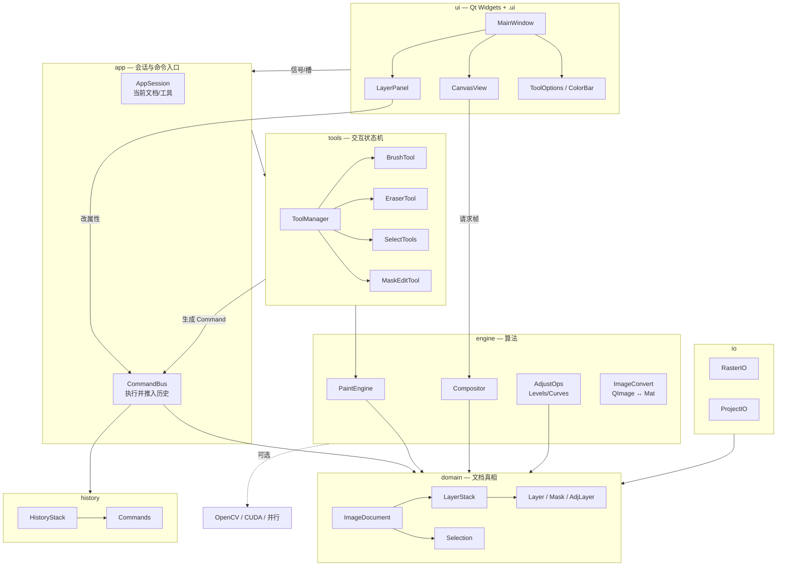
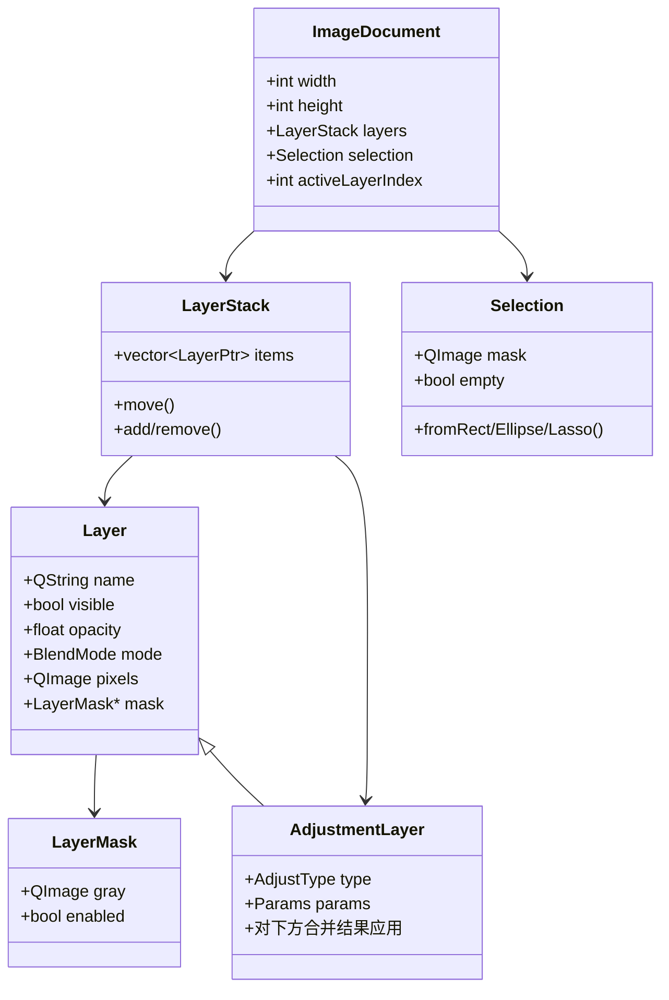
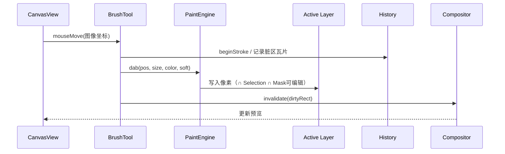
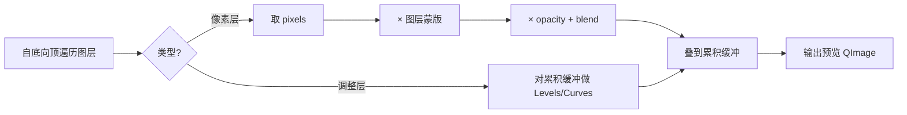

# 架构设计（参考 GIMP，面向本项目）

> 目标：支撑「完善 Demo」——文档/画布/历史/IO + 图层/选区/蒙版/简化调整/画笔。  
> 原则：学 GIMP 的**分层与职责分离**，不搬 GEGL/PDB/插件体系。

---

## 1. 从 GIMP 学到的分层（简化对照）

GIMP 主程序大致是：

```text
GUI / actions / dialogs / display / tools     ← 交互与显示
        ↓
core（Image / Layer / Channel / Selection…） ← 文档模型
paint / operations / gegl                      ← 像素算法
        ↓
undo / file / xcf                              ← 历史与存盘
```

关键启发（必须保留）：

| GIMP 做法 | 本项目对应 |
|-----------|------------|
| `tools` 与 `paint` 分离 | Tool 只处理事件；PaintEngine 写像素 |
| `core` 拥有图层/选区真相 | `domain` 拥有 Document，UI 不直接改缓冲 |
| 投影/合成与单层像素分开 | `Compositor` 只读图层生成预览 |
| display 负责画布变换 | `CanvasView` 负责缩放平移，不拥有图层数据 |
| 不做 PDB/插件 | 本项目直接函数调用即可 |

---

## 2. 本项目目标架构（总图）



**依赖方向（强制）**：`ui → app → tools/domain`；`engine` 被 `tools`/`domain` 调用；**禁止** `domain` 依赖 Qt Widgets。

---

## 3. 逻辑分层说明

| 层 | 职责 | 不做什么 |
|----|------|----------|
| **ui** | 布局（`.ui`）、显示合成图、面板列表、快捷键 | 不写像素算法；不直接改 `QImage` 像素 |
| **app** | 当前文档、当前工具、把 UI 动作收成命令 | 不出现具体笔刷公式 |
| **tools** | 指针状态、拖拽手势、把笔画变成对层的修改请求 | 不实现混合模式公式（交给 engine） |
| **domain** | `ImageDocument`、图层栈、蒙版、选区、调整层参数 | 不懂得画按钮 |
| **engine** | 笔刷戳点、合成、色阶曲线、可选 OpenCV/CUDA | 不弹对话框 |
| **history** | 命令或瓦片快照的撤销重做 | 不负责 UI |
| **io** | PNG/JPEG、自有工程格式 | 不改工具状态 |

---

## 4. 文档对象模型（核心数据）



说明：

- **像素层** `Layer`：持有 `QImage`（建议 Format_ARGB32_Premultiplied）
- **蒙版** `LayerMask`：同尺寸灰度；合成时 `alpha *= mask`
- **选区** `Selection`：文档级一张 mask；绘制时与之相交
- **调整层**：特殊层，合成阶段对「已合成的下方」做 Levels/Curves（简化非破坏）

---

## 5. 关键数据流

### 5.1 画笔绘制



### 5.2 图层合成（预览 / 导出共用）



### 5.3 撤销

推荐 **混合策略**（简历好讲、实现可控）：

- 属性改动（显隐、透明度、层序）：小命令对象  
- 像素改动（画笔、蒙版涂抹）：按脏矩形存瓦片快照  

```text
HistoryStack: undoStack / redoStack
Command::redo() / undo()
```

---

## 6. 目录结构（`psDemo/`）

> `[x]` = 已落地；其余为规划。分层是**强制**的依赖方向：
> `ui → app → tools/domain`，`engine` 被 `tools`/`domain` 调用，
> **`domain`/`engine` 禁止依赖 Qt Widgets**。

```text
psDemo/
  main.cpp
  mainwindow.ui / .h / .cpp          [x] 壳，只拼装 + 菜单接线
  app/
    appsession.*                     [x] 当前文档持有者 + 广播中心
    commands/                        [ ] 具体 Command 类
  domain/
    imagedocument.*                  [x] 分级信号 + 语义化 setter + 累计脏区
    layer.* / layerstack.*           [x] 图层；Layer 持 owner 回指
    layermask.*                      [ ] 蒙版
    selection.*                      [ ] 选区
    adjustmentlayer.*                [ ] 调整层
  tools/
    toolid.h / toolevent.h           [x] 工具枚举 + 规范化事件
    toolcontext.h                    [x] ToolContext + ViewPort
    tool.* / toolmanager.*           [x] 基类 + 注册表 + 事件分发
    movetool.* / handtool.*          [x] 移动（占位）/ 平移
    zoomtool.* / painttool.*         [x] 锚点缩放 / 画笔橡皮
    selectrecttool.* / ...           [ ] 选区类工具
  engine/
    paintengine.*                    [x] dab + 线段插值
    compositor.*                     [x] 预乘 Alpha 合成（脏区接口已留）
    adjust/levels.* / curves.*       [ ]
    convert/qimage_cv.*              [ ] 可选 OpenCV
    accel/                           [ ] 可选 CUDA / 并行
  history/
    historystack.* / command.*       [ ] 撤销（Phase 6）
  io/
    rasterio.* / projectio.*         [ ] 导出与工程文件
  ui/
    canvasview.*                     [x] 视图变换 / 绘制 / 事件归一化转发
    canvasworkspace.*                [x] 标尺 + 画布 + 底栏 + 滚动条
    canvasdocstatusbar.*             [x] 缩放% + 文档信息
    rulerwidget.*                    [x] 自绘标尺（自绘例外）
    itemtreepanel.*                  [x] Item 树基类
    layertreepanel.*                 [x] 图层树（增量更新 + 滑条两段提交）
    channeltreepanel.*               [x] 通道树（无 domain）
    pathtreepanel.*                  [x] 路径树（无 domain）
    dockpanel.*                      [x] 右侧三 Tab 停靠壳（.ui 名 layerpanel.ui）
    toolbox.* / tooloptionsbar.*     [x] 工具箱 / 选项栏
    colorpickerdialog.*              [x] PS 风格拾色器
```

界面相关继续遵守：面板用 **`.ui`**；`CanvasView` 可自绘，但其停靠位置由主窗口 `.ui` 排布。

---

## 7. 与「完善功能」的映射

| 完善项 | 落在哪一层 |
|--------|------------|
| 图层 / 蒙版 / 调整层 | `domain` + `Compositor` |
| 选区 | `domain/Selection` + select tools + Paint 约束 |
| 画笔 | `tools` + `PaintEngine` |
| 画布缩放平移 | `ui/CanvasView` |
| 撤销 | `history` |
| 打开导出/工程 | `io` |
| OpenCV/CUDA | 仅 `engine/`，UI 无感；保留 CPU 回退 |

**不做**：PDB、插件进程、完整路径系统、用户通道面板（通道数据可内化在 Selection/Mask 的 `QImage` 里）。

---

## 8. 落地顺序

> **本节已被 §8.2 取代**（撤销提前、插入「留缝」阶段）。保留此处仅作历史对照。

1. `domain` 最小文档 + `Compositor` + `CanvasView`  
2. `LayerPanel` + 图层命令 + `History`  
3. `BrushTool` + `PaintEngine`  
4. `Selection` + 选区工具 + 绘制约束  
5. `LayerMask`  
6. `AdjustmentLayer` 或破坏式 AdjustOps  
7. `ProjectIO` + 变换/裁剪（完善度 P1）  

---

## 8.1 三条架构主线（对应 GIMP 参照）

> 详见 [wiki/Roadmap](../wiki/Roadmap.md) Phase 6–8。此处只记**本项目取舍**。

### ③ 节点化非破坏编辑（滤镜 / 调整层）

【对照 GIMP】`app/gegl/gimpapplicator.c`、`app/core/gimpdrawablefilter.c`、`gimpfilterstack.c`、`gimpfilteredcontainer.c`，配合 `app/operations/layer-modes/`（17 个 GEGL op）。

**GIMP 的洞见**：图层混合模式、滤镜、非破坏编辑**全都是 GEGL 节点，走同一条路**；滤镜因而成为「可重排、可带蒙版、可整体开关」的**节点栈**，而不是「点一下 → 改像素 → 写回图层」的一次性栅格化。

**本项目落地方式**：**不引入 GEGL**。只取「滤镜是节点」的语义，做成一个**只读滤镜节点栈**：

- `Layer` 允许**无可编辑像素**（调整层无自有像素，只声明参数与输入）
- 滤镜节点：增 / 删 / 重排 / 开关 / 参数；**只读**，不得就地改写 `Layer::pixels`
- 调整层对「已合成的下方结果」求值（色阶 / 曲线起步）
- 【前置依赖】投影管线须支持节点求值 → **依赖主线 ② 的脏区机制已在位**

### ② 模型与投影分离 + 脏区分块更新

【对照 GIMP】`app/core/gimpprojection.c`（`update_region` / `priority_rect` / `iter` / `idle_id`，按 32×32 chunk 迭代）、`app/gegl/gimptilehandlervalidate.c`（603 行，脏区核心）、`app/core/gimpchunkiterator.c`。

**GIMP 的洞见**：① 文档是真相、投影是缓存，二者接口解耦；② 存储稀疏，只为写过的块分配内存；③ 更新按**脏区 + 优先级**，而非重算全图。

**本项目落地方式**：暂**不分块稀疏存储、不做优先级渲染线程**，只做「**脏矩形集合 + 分块缓存 + 按需重算**」：

- 文档级脏区信令：`dirty(QRect)` / `structureChanged()` / `activeLayerChanged()`
- `Compositor` 由「全量合成」升级为「按脏矩形 + 分块（如 64×64）缓存重算」
- 取消各处散落的 `update()`，统一由脏区驱动
- 【现状】`Compositor` 已可按矩形脏区合成，但**缺少上层调度**——即有零件、无管线

### ① 推入式撤销 + 每对象一类

【对照 GIMP】`app/core/gimpimage-undo-push.c`（46 KB）与 `gimpimage-undo-push.h` 的 **50+ 个 `gimp_image_undo_push_*` 入口**；每类对象一个 undo 子类（`gimpdrawableundo` / `gimplayerundo` / `gimpitemundo` / `gimpmaskundo` / `gimplayerpropundo` / `gimpchannelundo` / `gimpdrawablefilterundo` / `gimplinklayerundo`…）。

**GIMP 的洞见**：撤销是「**改动之前，先把旧状态推入栈**」，而非「改动之后记录做了什么」；且每个对象类型有自己的逆操作语义。这套 push 入口构成一份**「一个图像编辑器有哪些状态必须可撤销」的现成清单**。

**本项目落地方式**：裁到 4 类 push 入口起步：

| 入口 | 覆盖 |
|------|------|
| `pushDrawablePixels` | 像素改动（画笔 / 橡皮 / 滤镜），按脏矩形存快照 |
| `pushLayerProp` | 显隐 / 不透明度 / 名称 / 混合模式 |
| `pushLayerStructure` | 新建 / 删除 / 上移 / 下移 / 合并 |
| `pushDocumentProp` | 尺寸 / 分辨率 / 活动层 |

【约束】**改文档状态而不 push = bug**。这是纪律，编译器帮不上忙，靠评审与约定守。

---

## 8.2 修正后的落地顺序

> 修订自本文 §8。原因：撤销（主线 ①）若晚于「按钮小功能批量实现」，则每个改文档状态的入口都要返工，且漏一处即**静默不可撤销**，故必须前置。

```text
0. 留缝【已完成】
   ├─ ImageDocument 信号分级 + markDirty(rect) 累计脏区  ✅
   ├─ 图层变更 API 收口（语义化 setter）              ✅
   ├─ Compositor 保持只读                            ✅
   └─ 附带：抽出 tools/ 工具层 + app/AppSession 广播   ✅
        ↓
1. domain 最小文档 + Compositor + CanvasView        （已完成）
2. 图层面板 + 图层命令                                （已完成）
3. 画笔 / 橡皮 + PaintEngine                          （已完成）
4. ① 推入式撤销 + 命令层        ← 下一步，勿拖到最后
5. 其余 UI 按钮小功能（逐个补，每个天然带撤销）
6. v1 闭环：导出 PNG/JPEG（Phase 3 收尾）
        ↓
7. ② 投影与脏区分块（Compositor 内部升级，UI 无感）
8. ③ 调整层 + 节点化滤镜栈（前置：第 7 步）
9. Selection + 选区工具 + 绘制约束
10. LayerMask
11. ProjectIO + 变换 / 裁剪（完善度 P1）
```

第 0 步的落地情况见 `docs/ui-review.md`：信号分级、`markDirty(rect)`、语义化 setter
均已就位，另附带抽出 `tools/` 工具层与 `app/AppSession`（后两者本不在「留缝」清单内，
但它们同样属于「越晚做越贵」的结构债 —— 详见该文档 §2）。

**顺序理由**：

| 项 | 能否后置 | 理由 | 现在必须留的缝 |
|----|---------|------|---------------|
| ① 撤销 | **否** | 后补则每个状态变更入口返工；漏一处静默失效 | 文档变更 API 收口 |
| ② 脏区投影 | 可 | 是 `Compositor` 内部改造，UI 无感 | 变更信令 `dirty(rect)` |
| ③ 节点化 | 可 | 本质是「一种新图层类型」，可加在最后 | `Layer` 别把 `QImage pixels` 写死为必需 |

---

## 9. 当前状态

> UI 结构的一次完整审查与收口见 `docs/ui-review.md`。

| 模块 | 状态 |
|------|------|
| 架构设计 | 已定（本文） |
| domain + Compositor + CanvasView | **已实现** |
| app/AppSession（文档广播中心） | **已实现** |
| tools/ToolManager + Tool 基类 + 4 个工具 | **已实现**（本文 §2 早先规划的 `tools` 层） |
| LayerPanel → DockPanel + 三个 tree panel | **已实现** |
| 信号分级 + 语义化 setter + 累计脏区 | **已实现**（撤销与分块重合成的接口就位） |
| 三、① 推入式撤销（Phase 6） | **计划已定**，未实现 —— 收口点已在 §8.1 |
| 三、② 脏区分块投影（Phase 7） | **计划已定**，未实现；`pixelsChanged(rect)` 已带脏区但未使用 |
| 三、③ 节点化非破坏（Phase 8） | **计划已定**，未实现；依赖 ② |
| 独立 actions/commands 层 | 未实现（当前收口在 domain 语义化 setter） |
| 其余（Selection / 蒙版 / IO） | 未实现 |
