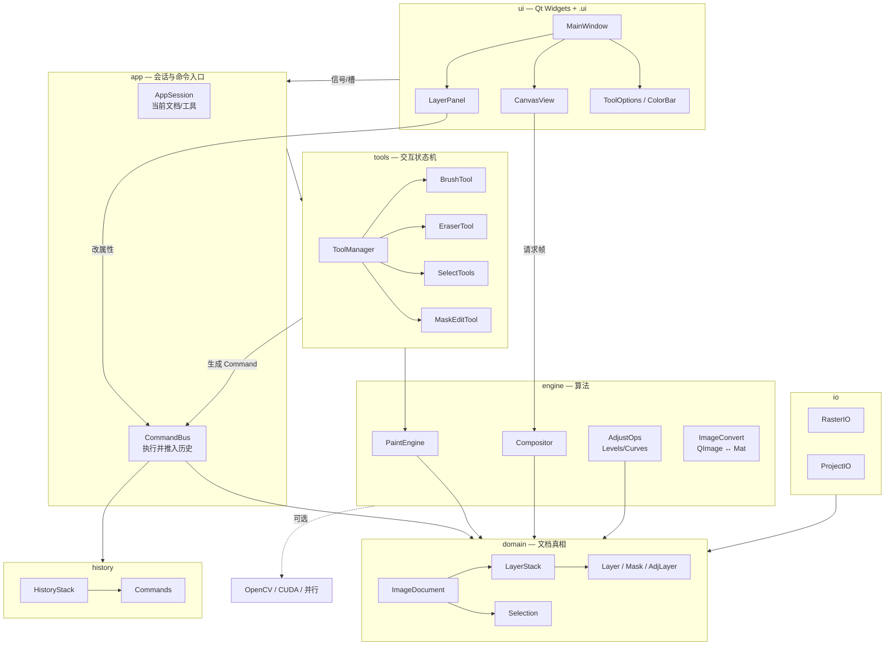
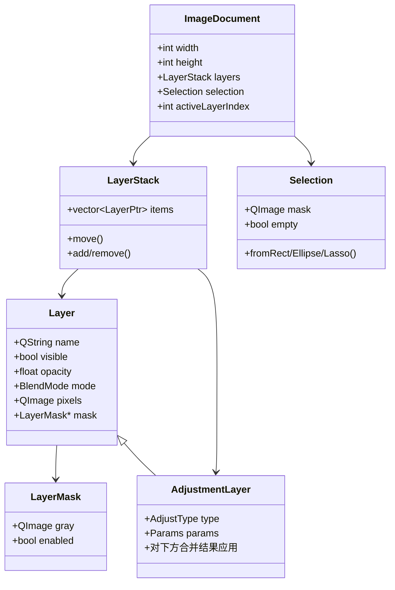
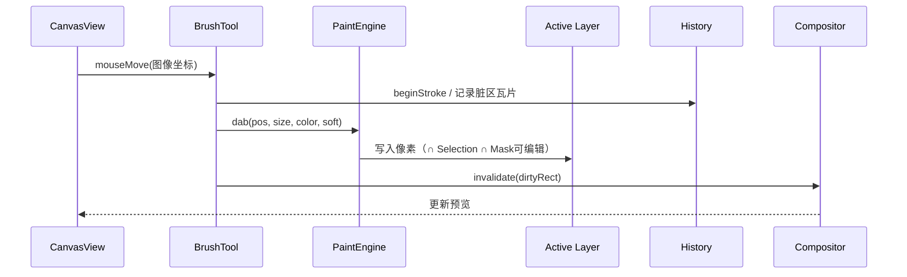
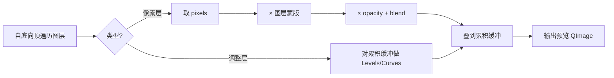

# 架构设计（参考 GIMP，面向本项目）

> 目标：支撑「完善 Demo」——文档/画布/历史/IO + 图层/选区/蒙版/简化调整/画笔。  
> 原则：学 GIMP 的**分层与职责分离**，不搬 GEGL/PDB/插件体系。

---

## 1. 从 GIMP 学到的分层（简化对照）

GIMP 主程序大致是：

```text
GUI / actions / dialogs / display / tools     ← 交互与显示
        ↓
core（Image / Layer / Channel / Selection…） ← 文档模型
paint / operations / gegl                      ← 像素算法
        ↓
undo / file / xcf                              ← 历史与存盘
```

关键启发（必须保留）：

| GIMP 做法 | 本项目对应 |
|-----------|------------|
| `tools` 与 `paint` 分离 | Tool 只处理事件；PaintEngine 写像素 |
| `core` 拥有图层/选区真相 | `domain` 拥有 Document，UI 不直接改缓冲 |
| 投影/合成与单层像素分开 | `Compositor` 只读图层生成预览 |
| display 负责画布变换 | `CanvasView` 负责缩放平移，不拥有图层数据 |
| 不做 PDB/插件 | 本项目直接函数调用即可 |

---

## 2. 本项目目标架构（总图）



**依赖方向（强制）**：`ui → app → tools/domain`；`engine` 被 `tools`/`domain` 调用；**禁止** `domain` 依赖 Qt Widgets。

---

## 3. 逻辑分层说明

| 层 | 职责 | 不做什么 |
|----|------|----------|
| **ui** | 布局（`.ui`）、显示合成图、面板列表、快捷键 | 不写像素算法；不直接改 `QImage` 像素 |
| **app** | 当前文档、当前工具、把 UI 动作收成命令 | 不出现具体笔刷公式 |
| **tools** | 指针状态、拖拽手势、把笔画变成对层的修改请求 | 不实现混合模式公式（交给 engine） |
| **domain** | `ImageDocument`、图层栈、蒙版、选区、调整层参数 | 不懂得画按钮 |
| **engine** | 笔刷戳点、合成、色阶曲线、可选 OpenCV/CUDA | 不弹对话框 |
| **history** | 命令或瓦片快照的撤销重做 | 不负责 UI |
| **io** | PNG/JPEG、自有工程格式 | 不改工具状态 |

---

## 4. 文档对象模型（核心数据）



说明：

- **像素层** `Layer`：持有 `QImage`（建议 Format_ARGB32_Premultiplied）
- **蒙版** `LayerMask`：同尺寸灰度；合成时 `alpha *= mask`
- **选区** `Selection`：文档级一张 mask；绘制时与之相交
- **调整层**：特殊层，合成阶段对「已合成的下方」做 Levels/Curves（简化非破坏）

---

## 5. 关键数据流

### 5.1 画笔绘制



### 5.2 图层合成（预览 / 导出共用）



### 5.3 撤销

推荐 **混合策略**（简历好讲、实现可控）：

- 属性改动（显隐、透明度、层序）：小命令对象  
- 像素改动（画笔、蒙版涂抹）：按脏矩形存瓦片快照  

```text
HistoryStack: undoStack / redoStack
Command::redo() / undo()
```

---

## 6. 建议目录结构（`psDemo/`）

```text
psDemo/
  main.cpp
  mainwindow.ui / .h / .cpp          # 壳，只拼装
  ui/
    canvasview.*
    layerpanel.ui / .*
    tooloptions.ui / .*
  app/
    appsession.*
    commands/                        # 具体 Command 类
  domain/
    imagedocument.*
    layer.* / layermask.* / layerstack.*
    selection.*
    adjustmentlayer.*
  tools/
    tool.h / toolmanager.*
    brushtool.* / erasertool.*
    selectrecttool.* / ...
  engine/
    paintengine.*
    compositor.*
    adjust/levels.* / curves.*
    convert/qimage_cv.*              # 可选 OpenCV
    accel/                           # 可选 CUDA / 并行
  history/
    historystack.* / command.*
  io/
    rasterio.* / projectio.*
```

界面相关继续遵守：面板用 **`.ui`**；`CanvasView` 可自绘，但其停靠位置由主窗口 `.ui` 排布。

---

## 7. 与「完善功能」的映射

| 完善项 | 落在哪一层 |
|--------|------------|
| 图层 / 蒙版 / 调整层 | `domain` + `Compositor` |
| 选区 | `domain/Selection` + select tools + Paint 约束 |
| 画笔 | `tools` + `PaintEngine` |
| 画布缩放平移 | `ui/CanvasView` |
| 撤销 | `history` |
| 打开导出/工程 | `io` |
| OpenCV/CUDA | 仅 `engine/`，UI 无感；保留 CPU 回退 |

**不做**：PDB、插件进程、完整路径系统、用户通道面板（通道数据可内化在 Selection/Mask 的 `QImage` 里）。

---

## 8. 落地顺序（与架构一致）

1. `domain` 最小文档 + `Compositor` + `CanvasView`  
2. `LayerPanel` + 图层命令 + `History`  
3. `BrushTool` + `PaintEngine`  
4. `Selection` + 选区工具 + 绘制约束  
5. `LayerMask`  
6. `AdjustmentLayer` 或破坏式 AdjustOps  
7. `ProjectIO` + 变换/裁剪（完善度 P1）  

---

## 9. 当前状态

| 模块 | 状态 |
|------|------|
| 架构设计 | 已定（本文） |
| domain + Compositor + CanvasView | **已实现** |
| LayerPanel | **已实现** |
| 其余（tools / history / 蒙版…） | 未实现 |
