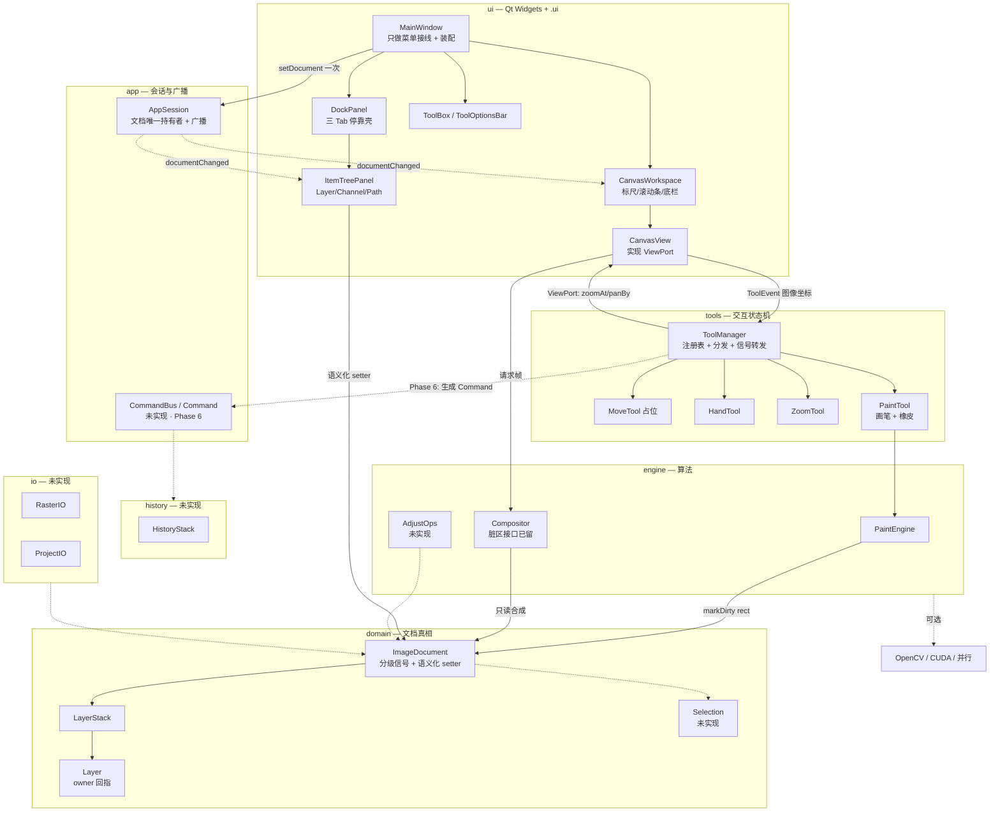
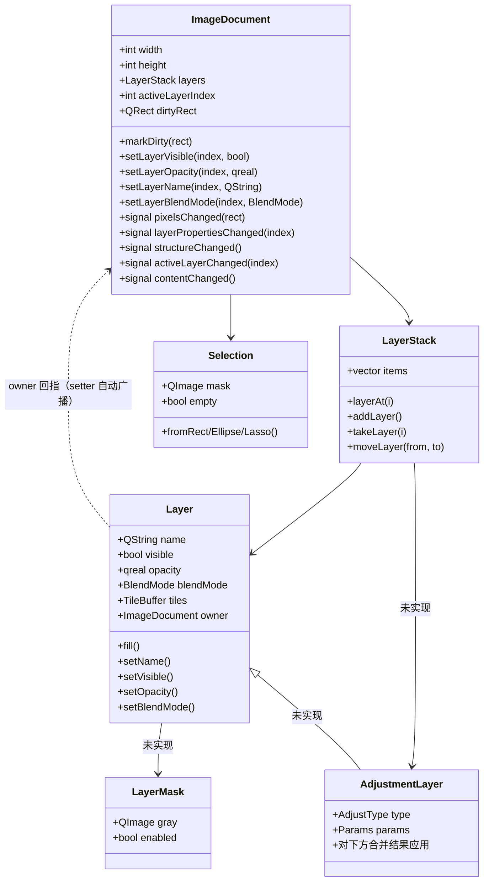
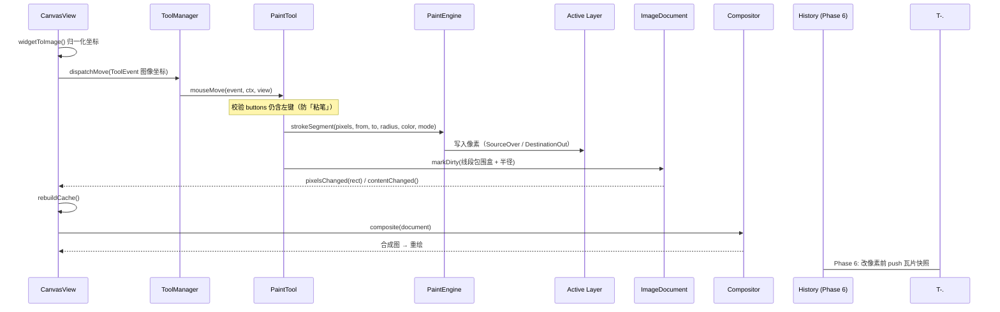
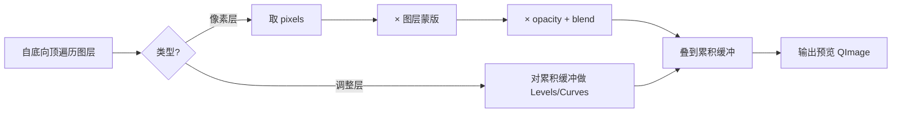

# 架构设计（参考 GIMP，面向本项目）

> 目标：支撑「完善 Demo」——文档/画布/历史/IO + 图层/选区/蒙版/简化调整/画笔。  
> 原则：学 GIMP 的**分层与职责分离**，不搬 GEGL/PDB/插件体系。

---

## 1. 从 GIMP 学到的分层（简化对照）

GIMP 主程序大致是：

```text
GUI / actions / dialogs / display / tools     ← 交互与显示
        ↓
core（Image / Layer / Channel / Selection…） ← 文档模型
paint / operations / gegl                      ← 像素算法
        ↓
undo / file / xcf                              ← 历史与存盘
```

关键启发（必须保留）：

| GIMP 做法 | 本项目对应 |
|-----------|------------|
| `tools` 与 `paint` 分离 | Tool 只处理事件；PaintEngine 写像素 |
| `core` 拥有图层/选区真相 | `domain` 拥有 Document，UI 不直接改缓冲 |
| 投影/合成与单层像素分开 | `Compositor` 只读图层生成预览 |
| display 负责画布变换 | `CanvasView` 负责缩放平移，不拥有图层数据 |
| 不做 PDB/插件 | 本项目直接函数调用即可 |

---

## 2. 本项目目标架构（总图）


```mermaid
flowchart TB
  subgraph UI["ui — Qt Widgets + .ui"]
    MW[MainWindow<br/>只做菜单接线 + 装配]
    CV[CanvasView<br/>实现 ViewPort]
    CW[CanvasWorkspace<br/>标尺/滚动条/底栏]
    DP[DockPanel<br/>三 Tab 停靠壳]
    IT[ItemTreePanel<br/>Layer/Channel/Path]
    TB[ToolBox / ToolOptionsBar]
  end

  subgraph APP["app — 会话与广播"]
    AM[AppSession<br/>文档唯一持有者 + 广播]
    CM[CommandBus / Command<br/>未实现 · Phase 6]
  end

  subgraph TOOLS["tools — 交互状态机"]
    TM[ToolManager<br/>注册表 + 分发 + 信号转发]
    MT[MoveTool 占位]
    HT[HandTool]
    ZT[ZoomTool]
    PT[PaintTool<br/>画笔 + 橡皮]
    TM --> MT & HT & ZT & PT
  end

  subgraph DOMAIN["domain — 文档真相"]
    DOC[ImageDocument<br/>分级信号 + 语义化 setter]
    LS[LayerStack]
    LY[Layer<br/>owner 回指]
    SEL[Selection<br/>未实现]
    DOC --> LS --> LY
    DOC -.-> SEL
  end

  subgraph ENGINE["engine — 算法"]
    PE[PaintEngine]
    COMP[Compositor<br/>脏区接口已留]
    ADJ[AdjustOps<br/>未实现]
  end

  subgraph HIST["history — 未实现"]
    HS[HistoryStack]
  end

  subgraph IO["io — 未实现"]
    IOR[RasterIO]
    PRJ[ProjectIO]
  end

  MW --> CW
  MW --> DP
  MW --> TB
  CW --> CV
  DP --> IT

  %% 文档广播：MainWindow 只交付一次，其余全部靠 AppSession 转发
  MW -->|setDocument 一次| AM
  AM -.->|documentChanged| CW
  AM -.->|documentChanged| IT

  %% 事件流：画布归一化坐标后交给工具层
  CV -->|ToolEvent 图像坐标| TM
  TM -->|ViewPort: zoomAt/panBy| CV
  PT --> PE
  PE -->|markDirty rect| DOC
  COMP -->|只读合成| DOC
  CV -->|请求帧| COMP

  %% 工具/面板经语义化 setter 改 domain，Phase 6 起在同一入口 push
  IT -->|语义化 setter| DOC
  TM -.->|Phase 6: 生成 Command| CM
  CM -.-> HIST
  ADJ -.-> DOC
  IO -.-> DOC
  ENGINE -.->|可选| OCV[OpenCV / CUDA / 并行]
```

**依赖方向（强制）**：`ui → app → tools/domain`；`engine` 被 `tools`/`domain` 调用；**禁止** `domain` 依赖 Qt Widgets。
图中**实线 = 已实现**，**虚线 = 未实现或规划**。

---

## 3. 逻辑分层说明

| 层 | 职责 | 不做什么 |
|----|------|----------|
| **ui** | 布局（`.ui`）、显示合成图、面板列表、快捷键 | 不写像素算法；不直接改 `QImage` 像素 |
| **app** | 当前文档、当前工具、把 UI 动作收成命令 | 不出现具体笔刷公式 |
| **tools** | 指针状态、拖拽手势、把笔画变成对层的修改请求 | 不实现混合模式公式（交给 engine） |
| **domain** | `ImageDocument`、图层栈、蒙版、选区、调整层参数 | 不懂得画按钮 |
| **engine** | 笔刷戳点、合成、色阶曲线、可选 OpenCV/CUDA | 不弹对话框 |
| **history** | 命令或瓦片快照的撤销重做 | 不负责 UI |
| **io** | PNG/JPEG、自有工程格式 | 不改工具状态 |

---

## 4. 文档对象模型（核心数据）


```mermaid
classDiagram
  class ImageDocument {
    +int width
    +int height
    +LayerStack layers
    +int activeLayerIndex
    +QRect dirtyRect
    +markDirty(rect)
    +setLayerVisible(index, bool)
    +setLayerOpacity(index, qreal)
    +setLayerName(index, QString)
    +setLayerBlendMode(index, BlendMode)
    +signal pixelsChanged(rect)
    +signal layerPropertiesChanged(index)
    +signal structureChanged()
    +signal activeLayerChanged(index)
    +signal contentChanged()
  }
  class LayerStack {
    +vector items
    +layerAt(i)
    +addLayer()
    +takeLayer(i)
    +moveLayer(from, to)
  }
  class Layer {
    +QString name
    +bool visible
    +qreal opacity
    +BlendMode blendMode
    +TileBuffer tiles
    +ImageDocument owner
    +fill()
    +setName()
    +setVisible()
    +setOpacity()
    +setBlendMode()
  }
  class LayerMask {
    +QImage gray
    +bool enabled
  }
  class AdjustmentLayer {
    +AdjustType type
    +Params params
    +对下方合并结果应用
  }
  class Selection {
    +QImage mask
    +bool empty
    +fromRect/Ellipse/Lasso()
  }

  ImageDocument --> LayerStack
  ImageDocument --> Selection
  Layer ..> ImageDocument : owner 回指（setter 自动广播）
  LayerStack --> Layer
  LayerStack --> AdjustmentLayer : 未实现
  Layer --> LayerMask : 未实现
  Layer <|-- AdjustmentLayer : 未实现
```

说明（**加粗 = 已实现**）：

- **像素层** `Layer`：持有 **`TileBuffer`（64×64 懒分配，预乘 ARGB）**；
  新建统一 `Layer(extent)` → 可选 `fill` → `addLayer`（透明=0 块瓦片）。
  **并通过 `owner()` 回指 `ImageDocument`** —— `setName/setVisible/setOpacity/setBlendMode`
  内部改值后自动广播 `layerPropertiesChanged`，UI 无需手动 notify。
  细节见 [`docs/layers/`](layers/README.md)。
- **`ImageDocument`**：除尺寸/栈/活动层外，还有**分级信号**与**累计脏区**（`markDirty(rect)`），
  以及供 UI 使用的**语义化 setter**（`setLayerVisible/Opacity/Name/BlendMode`）。
- 蒙版 `LayerMask`：**已实现** — 层局部 `Format_Grayscale8`；合成时 `alpha *= mask`（白显黑藏）；
  `ImageDocument::addLayerMask/removeLayerMask/setLayerMaskEnabled` + `LayerPropUndo`；
  `setEditingLayerMask` + 画笔写蒙版（`PaintEngine::stampMaskDab`）；
  添加蒙版后自动进入蒙版编辑，并取消选区以免继续裁剪蒙版绘制；
  `applyLayerMask` / `setLayerMaskLinked`；写入 `.pslite`
  **未做**：矢量蒙版、通道面板载入蒙版
- **选区** `Selection`：文档级一张 `Format_Grayscale8` mask（对照 `gimp_image_get_mask`）；
  矩形工具写入；蚂蚁线由 `CanvasView` 根据 bounds 绘制；
  **绘制约束已接**：空选区不裁剪；非空时笔刷/橡皮/油漆桶/渐变只改 mask>0（对照 `gimp_item_mask_intersect`）
- **调整层**：特殊层，合成阶段对「已合成的下方」做 Levels/Curves（简化非破坏）

---

## 5. 关键数据流

### 5.1 画笔绘制

> **实线 = 已实现**；`History` 相关为 Phase 6 规划（虚线）。


```mermaid
sequenceDiagram
  participant U as CanvasView
  participant TM as ToolManager
  participant T as PaintTool
  participant P as PaintEngine
  participant L as Active Layer
  participant D as ImageDocument
  participant C as Compositor
  participant H as History (Phase 6)

  U->>U: widgetToImage() 归一化坐标
  U->>TM: dispatchMove(ToolEvent 图像坐标)
  TM->>T: mouseMove(event, ctx, view)
  Note over T: 校验 buttons 仍含左键（防「粘笔」）
  T->>P: strokeSegment(pixels, from, to, radius, color, mode)
  P->>L: 写入像素（SourceOver / DestinationOut）
  T->>D: markDirty(线段包围盒 + 半径)
  D-->>U: pixelsChanged(rect) / contentChanged()
  U->>U: rebuildCache()
  U->>C: composite(document)
  C-->>U: 合成图 → 重绘
  T-.->H: Phase 6: 改像素前 push 瓦片快照
```

**与 GIMP 的对应**：`ToolManager` + `PaintTool` ≈ `app/tools`（管事件），
`PaintEngine` ≈ `app/paint/GimpPaintCore`（写缓冲），`Compositor` ≈ projection（只读合成）。
【本项目简化】无 GEGL、无笔刷资源库；选区约束已接（空选区=不裁）；图层蒙版乘算已接（无在蒙版上涂画）。

### 5.2 图层合成（预览 / 导出共用）

概念说明（文档/画布、Alpha、预乘、刷新策略、瓦片与内存）见 [`docs/layers/`](layers/README.md)。


```mermaid
flowchart LR
  A[自底向顶遍历图层] --> B{类型?}
  B -->|像素层| C[取 pixels]
  C --> D[× 图层蒙版]
  D --> E[× opacity + blend]
  E --> F[叠到累积缓冲]
  B -->|调整层| G[对累积缓冲做 Levels/Curves]
  G --> F
  F --> H[输出预览 QImage]
```

### 5.3 撤销

> **决策已定**（见 `docs/tech-notes.md`「撤销」一节）：采用 GIMP 的**推入式（push）+ 每对象一类**，
> 放弃早先「命令模式 vs 瓦片快照」的二选一。Phase 6 已落地。
>
> **对照 GIMP**：无独立 Command 总线；改状态走核心 mutate API，API 内 `push_undo`。
> 本项目等价做法：UI/工具只调 `ImageDocument` 语义化方法，**push 写在这些方法里**（或绘制类在写像素前调 `pushLayerPixelsUndo`）。

**语义**：**改动之前**先把旧状态推入栈，而不是事后记录「做了什么」。

| 入口 | 覆盖 | 落点 |
|------|------|------|
| `pushLayerPixelsUndo` | 像素（含 offset，变换扩层可逆） | 绘制工具 stroke 前 / 清除填充 / 变换提交 |
| `pushLayerPropUndo` | 显隐/不透明度/名/混合/偏移/**样式**/**滤镜** | `setLayer*`、`ensure/replace/clear` 样式、滤镜 API 内 |
| `LayerStructureUndo` | 新建 / 删除 / 复制 | `addLayer` / `removeLayer` / `duplicateLayer` 内 |
| `pushDocumentGeomUndo` | 图像/画布大小、裁剪 | `scaleImage` / `resizeCanvas` / `cropTo` 内 |
| `pushSelectionUndo` | 选区 mask | `select*` / `clearSelection` / `invertSelection` 内 |

```text
HistoryStack: undoStack / redoStack（含内存上限，超限丢最老）
```

**收口点已就位**：UI 已不直接改 `Layer`，一律走 `ImageDocument`；
因此 push 集中在少数 domain API —— 这是 Phase 6 低成本落地的前提。
不透明度滑条「松手才提交」，避免撤销栈被滑条淹没。

> 【对照 GIMP】`gimpimage-undo-push.h` 的 typed `push_*` + setter 内 `push_undo`；
> `gimp_image_undo_group_start/end` 把多步合成一步（本项目暂未做 group，多步仍可能多条）。
> 本项目取其**推入式**语义与**分组**思路（如一次笔画 = 一个撤销单元），
> 不做 `GimpUndoStack` / `GimpUndo` 的 GObject 层次规模。
> 注意：`contentChanged` 之类**信号不是撤销**，不要指望靠信号重放实现撤销。

---

## 6. 目录结构（`psDemo/`）

> `[x]` = 已落地；其余为规划。分层是**强制**的依赖方向：
> `ui → app → tools/domain`，`engine` 被 `tools`/`domain` 调用，
> **`domain`/`engine` 禁止依赖 Qt Widgets**。

```text
psDemo/
  main.cpp
  mainwindow.ui / .h / .cpp          [x] 壳，只拼装 + 菜单接线
  app/
    appsession.*                     [x] 当前文档持有者 + 广播中心
    commands/                        [ ] 具体 Command 类
  domain/
    imagedocument.*                  [x] 分级信号 + 语义化 setter + 累计脏区
    layer.* / layerstack.*           [x] 图层；Layer 持 owner 回指
    layermask.*                      [x] 灰度蒙版；合成乘 alpha；选区生成
    selection.*                      [x] 文档级 mask；矩形写入；绘制∩选区已接
    adjustmentlayer.*                [ ] 调整层
  tools/
    toolid.h / toolevent.h           [x] 工具枚举 + 规范化事件
    toolcontext.h                    [x] ToolContext + ViewPort
    tool.* / toolmanager.*           [x] 基类 + 注册表 + 事件分发
    movetool.* / handtool.*          [x] 移动（改 offset）/ 平移
    zoomtool.* / painttool.*         [x] 锚点缩放 / 画笔橡皮（∩选区）
    rectselecttool.*                 [x] → marqueeselecttool（矩形+椭圆）
    selectellipse / lasso / ...      [x] 椭圆选框 + 套索三件套（SelectPolygonOp）
  engine/
    paintengine.*                    [x] 门面：全部像素写经 op 转发
    compositor.*                     [x] 预乘 Alpha 合成；颜色经 LayerModeOp
    blend.*                          [x] 混合色算法（被 LayerModeOp 调用）
    op/                              [x] LayerMode / FloodFill / Gradient / StampDab / SolidFill
    adjust/levels.* / curves.*       [ ]
    convert/qimage_cv.*              [ ] 可选 OpenCV
    accel/                           [ ] 可选 CUDA / 并行
  app/
    historystack.* / undoitem.*      [x] 推入式撤销（Phase 6）
  io/
    projectio.*                      [x] .pslite 工程（图层+选区）
    psdio.*                          [x] .psd 子集导出（图层像素）；打开/完整 PSD 另做
  ui/
    canvasview.*                     [x] 视图变换 / 绘制 / 事件归一化转发
    canvasworkspace.*                [x] 标尺 + 画布 + 底栏 + 滚动条
    canvasdocstatusbar.*             [x] 缩放% + 文档信息
    rulerwidget.*                    [x] 自绘标尺（自绘例外）
    itemtreepanel.*                  [x] Item 树基类
    layertreepanel.*                 [x] 图层树（增量更新 + 滑条两段提交）
    channeltreepanel.*               [x] 通道树（无 domain）
    pathtreepanel.*                  [x] 路径树（无 domain）
    dockpanel.*                      [x] 右侧三 Tab 停靠壳（.ui 名 layerpanel.ui）
    toolbox.* / tooloptionsbar.*     [x] 工具箱 / 选项栏
    colorpickerdialog.*              [x] PS 风格拾色器
```

界面相关继续遵守：面板用 **`.ui`**；`CanvasView` 可自绘，但其停靠位置由主窗口 `.ui` 排布。

---

## 7. 与「完善功能」的映射

| 完善项 | 落在哪一层 |
|--------|------------|
| 图层 / 蒙版 / 调整层 | `domain` + `Compositor` |
| 选区 | `domain/Selection` + select tools + Paint 约束 |
| 画笔 | `tools` + `PaintEngine` |
| 画布缩放平移 | `ui/CanvasView` |
| 撤销 | `history` |
| 打开导出/工程 | `io` |
| OpenCV/CUDA | 仅 `engine/`，UI 无感；保留 CPU 回退 |

**不做**：PDB、插件进程、完整路径系统、用户通道面板（通道数据可内化在 Selection/Mask 的 `QImage` 里）。

---

## 8. 落地顺序

> ⚠️ **历史存档，勿据此施工**。本节是重构前的原始顺序，已被 §8.2 取代
> （撤销提前、插入「留缝」阶段）。其中 `LayerPanel` / `BrushTool` 等**是当时的命名**，
> 现分别叫 `DockPanel` / `PaintTool`。保留仅为对照规划演进。

1. `domain` 最小文档 + `Compositor` + `CanvasView`  
2. `LayerPanel`（现 `DockPanel`）+ 图层命令 + `History`  
3. `BrushTool`（现 `PaintTool`）+ `PaintEngine`  
4. `Selection` + 选区工具 + 绘制约束  
5. `LayerMask`  
6. `AdjustmentLayer` 或破坏式 AdjustOps  
7. `ProjectIO` + 变换/裁剪（完善度 P1）  

---

## 8.1 三条架构主线（对应 GIMP 参照）

> 详见 [wiki/Roadmap](../wiki/Roadmap.md) Phase 6–8。此处只记**本项目取舍**。

### ③ 节点化非破坏编辑（滤镜 / 调整层）

【对照 GIMP】`app/gegl/gimpapplicator.c`、`app/core/gimpdrawablefilter.c`、`gimpfilterstack.c`、`gimpfilteredcontainer.c`，配合 `app/operations/layer-modes/`（17 个 GEGL op）。

**GIMP 的洞见**：图层混合模式、滤镜、非破坏编辑**全都是 GEGL 节点，走同一条路**；滤镜因而成为「可重排、可带蒙版、可整体开关」的**节点栈**，而不是「点一下 → 改像素 → 写回图层」的一次性栅格化。

**本项目落地方式**：**不引入 GEGL**。Phase 6.5 已落地 `engine/op`：启动 `opsInit` 注册、pad 依赖、`OpRunner` 显式 prepare→process→finish；合成侧经 `PointOpRegistry` 取 `LayerModeOp`。Phase 8 再做**只读滤镜节点栈**：

- `Layer` 允许**无可编辑像素**（调整层无自有像素，只声明参数与输入）
- 滤镜节点：增 / 删 / 重排 / 开关 / 参数；**只读**，不得就地改写 `Layer::pixels`
- 调整层对「已合成的下方结果」求值（色阶 / 曲线起步）
- 【前置依赖】投影管线须支持节点求值 → **依赖主线 ② 的脏区机制已在位**

**滤镜库后续（Phase 9，已记入 Roadmap）**：产品级滤镜库须达成——

1. **完整 ROI / 节点缓存**（脏区传播，跳过未脏节点）  
2. **异步求值**（重滤镜 / 拖参不卡 UI，可取消合并）  
3. **多线程算子图**（依赖可并行；`OpRunner` 线程安全改造）

**雏形已在**：`BufferOp`+`OpRunner`（算子）与 `FilterStack`+`FilterEval`（线性非破坏链）。Phase 9 是**改造**而非新建：先把 `FilterEval` 收进 `OpRunner`，再引入 `engine/graph/`（`PsGraph`），最后上 ROI/异步/并行。详见 `wiki/Roadmap.md` §9.0。

仍自研演进，**不捆绑 GEGL**。Phase 8 的整层临时图求值是过渡形态。

### ② 模型与投影分离 + 脏区分块更新

【对照 GIMP】`app/core/gimpprojection.c`（`update_region` / `priority_rect` / `iter` / `idle_id`，按 32×32 chunk 迭代）、`app/gegl/gimptilehandlervalidate.c`（603 行，脏区核心）、`app/core/gimpchunkiterator.c`。

**GIMP 的洞见**：① 文档是真相、投影是缓存，二者接口解耦；② 存储稀疏，只为写过的块分配内存；③ 更新按**脏区 + 优先级**，而非重算全图。

**本项目落地方式**：暂**不分块稀疏存储、不做优先级渲染线程**，只做「**脏矩形集合 + 分块缓存 + 按需重算**」：

- 文档级脏区信令：`dirty(QRect)` / `structureChanged()` / `activeLayerChanged()`
- `Compositor` 由「全量合成」升级为「按脏矩形 + 分块（如 64×64）缓存重算」
- 取消各处散落的 `update()`，统一由脏区驱动
- 【现状】**管线已通**：`engine/projection.*` 是上层调度（对照 `GimpProjection`）——
  `Projection::sync()` 取 `ImageDocument::dirtyRect()`、对齐 64 chunk，脏区小于全图时走
  `Compositor::compositeRegion()` 就地重算。仍欠：分块有效位图、优先级渲染线程。
  算子侧如何把脏区报上来，见 [engine/operators.md](engine/operators.md) §3.6

### ① 推入式撤销 + 每对象一类

【对照 GIMP】`app/core/gimpimage-undo-push.c`（46 KB）与 `gimpimage-undo-push.h` 的 **50+ 个 `gimp_image_undo_push_*` 入口**；每类对象一个 undo 子类（`gimpdrawableundo` / `gimplayerundo` / `gimpitemundo` / `gimpmaskundo` / `gimplayerpropundo` / `gimpchannelundo` / `gimpdrawablefilterundo` / `gimplinklayerundo`…）。

**GIMP 的洞见**：撤销是「**改动之前，先把旧状态推入栈**」，而非「改动之后记录做了什么」；且每个对象类型有自己的逆操作语义。这套 push 入口构成一份**「一个图像编辑器有哪些状态必须可撤销」的现成清单**。

**本项目落地方式**（对照 GIMP core mutate + push，非 Command 层）：

| 入口 | 覆盖 |
|------|------|
| `pushLayerPixelsUndo` | 像素 + offset（画笔 / 变换提交等） |
| `pushLayerPropUndo` | 显隐 / 不透明度 / 名 / 混合 / 偏移 / **样式** / **滤镜** |
| `LayerStructureUndo` | 新建 / 删除 / 复制 |
| `pushDocumentGeomUndo` | 图像大小 / 画布大小 / 裁剪 |
| `pushSelectionUndo` | 选区 mask |

【约束】**改文档状态而不 push = bug**。纪律靠评审；编译器帮不上忙。

---

## 8.2 修正后的落地顺序

> 修订自本文 §8。原因：撤销（主线 ①）若晚于「按钮小功能批量实现」，则每个改文档状态的入口都要返工，且漏一处即**静默不可撤销**，故必须前置。

```text
0. 留缝【已完成】
   ├─ ImageDocument 信号分级 + markDirty(rect) 累计脏区  ✅
   ├─ 图层变更 API 收口（语义化 setter）              ✅
   ├─ Compositor 保持只读                            ✅
   └─ 附带：抽出 tools/ 工具层 + app/AppSession 广播   ✅
        ↓
1. domain 最小文档 + Compositor + CanvasView        （已完成）
2. 图层面板 + 图层命令                                （已完成）
3. 画笔 / 橡皮 + PaintEngine                          （已完成）
4. ① 推入式撤销（domain API 内 push；无独立 Command 层）  ✅
5. 其余 UI 按钮小功能（逐个补，每个天然带撤销）
6. v1 闭环：导出 PNG/JPEG（Phase 3 收尾）  ✅
        ↓
7. ② 投影与脏区分块（Compositor 内部升级，UI 无感）  ✅
8. ③ 调整层 + 节点化滤镜栈（前置：第 7 步）  
9. Phase 9 滤镜库：ROI 缓存 / 异步求值 / 多线程算子图（前置：第 8 步）
9. Selection + 选区工具 + 绘制约束
10. LayerMask
11. ProjectIO + 变换 / 裁剪（完善度 P1）
```

第 0 步的落地情况见 `docs/ui/ui-review.md`：信号分级、`markDirty(rect)`、语义化 setter
均已就位，另附带抽出 `tools/` 工具层与 `app/AppSession`（后两者本不在「留缝」清单内，
但它们同样属于「越晚做越贵」的结构债 —— 详见该文档 §2）。

**顺序理由**：

| 项 | 能否后置 | 理由 | 现在必须留的缝 |
|----|---------|------|---------------|
| ① 撤销 | **否** | 后补则每个状态变更入口返工；漏一处静默失效 | 文档变更 API 收口 |
| ② 脏区投影 | 可 | 是 `Compositor` 内部改造，UI 无感 | 变更信令 `dirty(rect)` |
| ③ 节点化 | 可 | 本质是「一种新图层类型」，可加在最后 | `Layer` 别把 `QImage pixels` 写死为必需 |

---

## 9. 当前状态

> UI 结构的一次完整审查与收口见 `docs/ui/ui-review.md`。

| 模块 | 状态 |
|------|------|
| 架构设计 | 已定（本文） |
| domain + Compositor + CanvasView | **已实现** |
| app/AppSession（文档广播中心） | **已实现** |
| tools/ToolManager + Tool 基类 + 4 个工具 | **已实现**（本文 §2 早先规划的 `tools` 层） |
| LayerPanel → DockPanel + 三个 tree panel | **已实现** |
| 信号分级 + 语义化 setter + 累计脏区 | **已实现**（撤销与分块重合成的接口就位） |
| 三、① 推入式撤销（Phase 6） | **已实现**（GIMP 式：domain API 内 push；含样式/滤镜/选区；无独立 commands 层） |
| 轻量算子壳（Phase 6.5） | **已实现**：注册表 + Runner + 混合/洪泛/渐变/填充；无 GEGL |
| 三、② 脏区分块投影（Phase 7） | **已实现**：`Projection` + `compositeRegion` + 64 块有效位 |
| 三、③ 节点化非破坏（Phase 8） | **首片已实现**：`FilterStack` + BrightnessContrast + 合成接入；调整层 / 对话框后置 |
| 四、滤镜库（Phase 9） | **计划中**：完整 ROI/节点缓存、异步求值、多线程算子图；仍不引入 GEGL |
| 独立 actions/commands 层 | **不做**（对照 GIMP：无 GoF Command；收口在 domain 语义化 API） |
| 其余（Selection / IO / Mask） | Selection + RasterIo/ProjectIo/PsdIo + **LayerMask** **已实现** |
