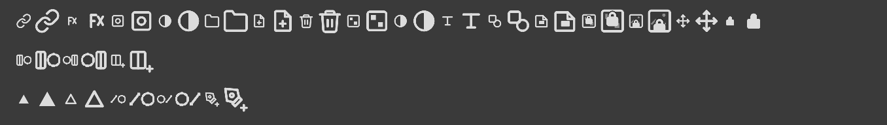

# 工具图标（iconfont）

规则见 `.cursor/rules/icon-sources.mdc`：优先从 [iconfont.cn](https://www.iconfont.cn/) 下载；禁止 Adobe 官方图标。

## 当前采用

目录：`psDemo/resources/icons/tools/`（**英文文件名** PNG）  
资源前缀：`:/icons/tools/`（见 `resources.qrc`）  
接线：`ui/toolbox.cpp` → `buildToolSlots()`

### 已接入映射（17 个占位槽 / 35 个工具，对齐 PS 默认工具箱分组）

| 组（快捷键） | 工具 | 文件 |
|---|---|---|
| 移动（V） | 移动 | `move.png` |
| 选框（M） | 矩形选框 / 椭圆选框 | `rect-select.png` / `ellipse-select.png` |
| 套索（L） | 套索 / 多边形套索 / 磁性套索 | `lasso.png` / `lasso-alt.png` / `magnetic-lasso.png` |
| 快速选择（W） | 快速选择 / 魔棒 | `quick-select.png` / `magic-wand.png` |
| 裁剪（C） | 裁剪 / 透视裁剪 | `crop.png` / `perspective.png` |
| 吸管（I） | 吸管 | `eyedropper.png` |
| 画笔（B） | 画笔 / 铅笔 / 混合器画笔 | `brush.png` / `pencil.png` / `brush-pencil.png` |
| 图章（S） | 仿制图章 | `stamp.png` |
| 橡皮擦（E） | 橡皮擦 / 背景橡皮擦 | `eraser.png` / `eraser-alt.png` |
| 填充（G） | 油漆桶 / 渐变 | `bucket.png` / `gradient.png` |
| 聚焦 | 模糊 / 锐化 / 涂抹 | `blur.png` / `sharpen.png` / `smudge.png` |
| 色调 | 减淡 / 海绵 | `adjust-add.png` / `sponge.png` |
| 钢笔（P） | 钢笔 / 自由钢笔 / 添加锚点 | `pen.png` / `pen-alt.png` / `pen-add.png` |
| 文字（T） | 横排文字 / 直排文字 | `type-horizontal.png` / `type-vertical.png` |
| 形状（U） | 矩形 / 椭圆 / 三角 / 直线 | `rectangle.png` / `ellipse.png` / `triangle.png` / `line.png` |
| 视图 | 抓手 / 缩放 | `hand.png` / `zoom.png` |

同组工具共用一个工具栏占位，右键飞出菜单切换。

⚠️ **实现状态**：只有 **移动 / 抓手 / 缩放 / 画笔 / 橡皮** 有实际逻辑。
其余工具是 **UI 占位** —— 选中后 `ToolManager` 回退到中性工具（不消费事件），
选项栏提示「该工具逻辑尚未接入」。**布局对齐 PS 是为了界面完整可演示，不代表功能已实现。**

目录内仍有 3 个未接线图标：`logo-icon.png`（应用图标，非工具）、`edit.png`、`smudge-alt.png`。

旧自绘 `tool-*.svg` 已删除；工具箱只使用 `:/icons/tools/*.png`。

## 菜单栏 / 工具选项条 chrome

目录：`psDemo/resources/icons/ui/`

| 用途 | 文件 | 说明 |
|------|------|------|
| 标题栏 / 任务栏图标 | `app-logo.png` + `app-logo.ico` | 圆角黑底灰色 Ps；`setWindowIcon` + `RC_ICONS` 嵌进 exe |
| 工具选项条左侧「家」 | `home.png` | `ToolOptionsBar` 的 `homeButton` |

接线：`setWindowTitle("PhotoshopLite")` + `QApplication`/`MainWindow` 的 `setWindowIcon`；
Windows 另用 `RC_ICONS = app-logo.ico` 嵌进 exe（任务栏靠这个）；产物名 `TARGET = PSLite`；家图标在选项条左端。

## 图层面板底栏图标

目录：`psDemo/resources/icons/layers/`（英文文件名 PNG）  
资源前缀：`:/icons/layers/`  
接线：`ui/layertreepanel.cpp` 构造时 `setIcon`

| 按钮 | 文件 | 隐喻 |
|------|------|------|
| 链接图层 | `link.png` | 双环相扣 |
| 图层样式 | `fx.png` | fx 字样（行业习惯） |
| 图层蒙版 | `mask.png` | 方框 + 圆 |
| 调整图层 | `adjustment.png` | 半满圆 |
| 新建组 | `group.png` | 文件夹 |
| 新建图层 | `new-layer.png` | 叠层 + 加号 |
| 删除 | `delete.png` | 垃圾桶 |

说明：暗色主题线框自绘，**非** Adobe 官方资源；后续若从 [iconfont.cn](https://www.iconfont.cn/) 换更精致版本，可按同名替换 SVG。

### 类型筛选行（PS 五种图层类型）

| 按钮 | 文件 | 隐喻 |
|------|------|------|
| 像素图层 | `filter-pixel.svg` | 方框内 2×2 棋盘（透明像素的通用隐喻） |
| 调整图层 | `filter-adjust.svg` | 半明半暗的圆 |
| 文字图层 | `filter-type.svg` | 字母 T |
| 形状图层 | `filter-shape.svg` | 方与圆叠加 |
| 智能对象 | `filter-smart.svg` | 带折角的文档 |

⚠️ **诚实标注**：本项目目前**只有像素层**，其余四类筛不出任何东西（调整层属 Roadmap Phase 8，
智能对象属 Phase 5）。按钮 tooltip 已写「尚未实现」，不做假的筛选逻辑。

### 锁定行（PS 四种锁）

| 按钮 | 文件 | 隐喻 |
|------|------|------|
| 锁定透明像素 | `lock-transparent.svg` | 棋盘 + 锁 |
| 锁定图像像素 | `lock-image.svg` | 图片框（小山+太阳）+ 锁 |
| 锁定位置 | `lock-position.svg` | 四向箭头 + 中心锚点 |
| 锁定全部 | `lock-all.svg` | 实心锁 |

> 修正记录：这 4 个按钮原先误用**工具**图标（魔棒/画笔/移动/裁剪）当锁，语义完全不对，已替换。

### 图标生成：`_gen_svg_icons.py`（SVG 矢量）

> 预览：
> 每格左为 **22px**（底栏按钮实际尺寸）、右为 **40px**（列表行尺寸）。

整套 24 个图标（图层 16 + 通道 3 + 路径 5）由**同一个**生成器产出 **SVG 矢量文件**：

| 项 | 值 |
|----|-----|
| 格式 | **SVG**（矢量，运行时按显示尺寸光栅化，任意尺寸/DPI 锐利） |
| viewBox | 24×24（Feather 风格） |
| 描边 | 统一 2.2，round cap/join |
| 主色 / 次级色 | `#DCDCDC` / `#8C8C8C` |
| 渲染 | `ItemTreePanel::svgIcon()`（Qt6Svg，1x/2x 双分辨率） |

运行方式：

```bash
cd psDemo/resources/icons/layers
python _gen_svg_icons.py     # 重新生成 24 个 .svg
```

**为什么换成 SVG**：早先是 48×48 PNG 逐像素画，显示时缩到 22px（底栏按钮）会发糊、无抗锯齿。
SVG 是矢量，由 Qt 在目标尺寸上直接光栅化，彻底解决「缩小就糊」。

### 从 iconfont.cn 替换的搜索关键词

若要换成更精致的成品图标，按此关键词下载 SVG/PNG，**同名替换**即可（`resources.qrc` 无需改）：

| 目标 | iconfont 搜索词 |
|------|----------------|
| 图层类型筛选（5 个） | `图层类型`、`像素图层`、`调整图层`、`文字图层`、`形状图层`、`智能对象` |
| 锁定（4 个） | `锁定`、`锁定透明`、`锁定位置`、`锁`、`padlock` |
| 链接图层 | `链接`、`图层链接` |
| 图层样式 fx | `图层样式`、`fx`、`混合选项` |
| 蒙版 / 调整 | `蒙版`、`图层蒙版`、`调整图层` |
| 新建组 / 新建图层 | `文件夹`、`新建图层`、`加号` |
| 删除 | `删除`、`垃圾桶` |
| 通道→选区 / 选区→通道 | `载入选区`、`存储选区`、`选区` |
| 路径填充 / 描边 | `路径填充`、`描边`、`钢笔` |

约定：**暗色主题优先单色/线框**；下载后放到对应目录（`layers/`、`channels/`、`paths/`）并保持英文文件名。

## 通道面板底栏图标

目录：`psDemo/resources/icons/channels/`  
资源前缀：`:/icons/channels/`  
接线：`ui/channeltreepanel.cpp`

| 按钮 | 文件 | 隐喻 |
|------|------|------|
| 通道→选区 | `load-selection.svg` | 竖条（通道）+ 虚线圆（选区）：**左源右目标** |
| 选区→通道 | `save-selection.svg` | 虚线圆 + 竖条（方向相反） |
| 新建通道 | `new-channel.svg` | 竖条 + 右下加号 |
| 删除 | `layers/delete.svg`（共用） | 垃圾桶 |

## 路径面板底栏图标

目录：`psDemo/resources/icons/paths/`  
资源前缀：`:/icons/paths/`  
接线：`ui/pathtreepanel.cpp`

| 按钮 | 文件 | 隐喻 |
|------|------|------|
| 填充路径 | `fill.svg` | **实心**三角 |
| 描边路径 | `stroke.svg` | **空心**三角（与填充同形状，一眼对照） |
| 路径→选区 | `to-selection.svg` | 斜线锚点（路径）+ 虚线圆（选区），**左源右目标** |
| 选区→路径 | `from-selection.svg` | 虚线圆 + 斜线锚点（方向相反） |
| 新建路径 | `new-path.svg` | 钢笔 + 右下加号 |
| 删除 | `layers/delete.svg`（共用） | 垃圾桶 |

通道/路径图标同样由 `layers/_gen_svg_icons.py` 产出（SVG 矢量）。

> **可辨认性设计约定**（22–24px 很小，必须靠轮廓而非细节区分）：
> 选区＝**虚线圆**（圆形轮廓）、通道＝**竖条**（竖向）、路径＝**斜线＋锚点**（斜向）。
> 互转类图标只放两个元件，**左＝源、右＝目标**。
> 试过加方向箭头：22px 下箭头太小反而糊成一团，已放弃（见 `tech-notes.md` 踩坑记录）。
