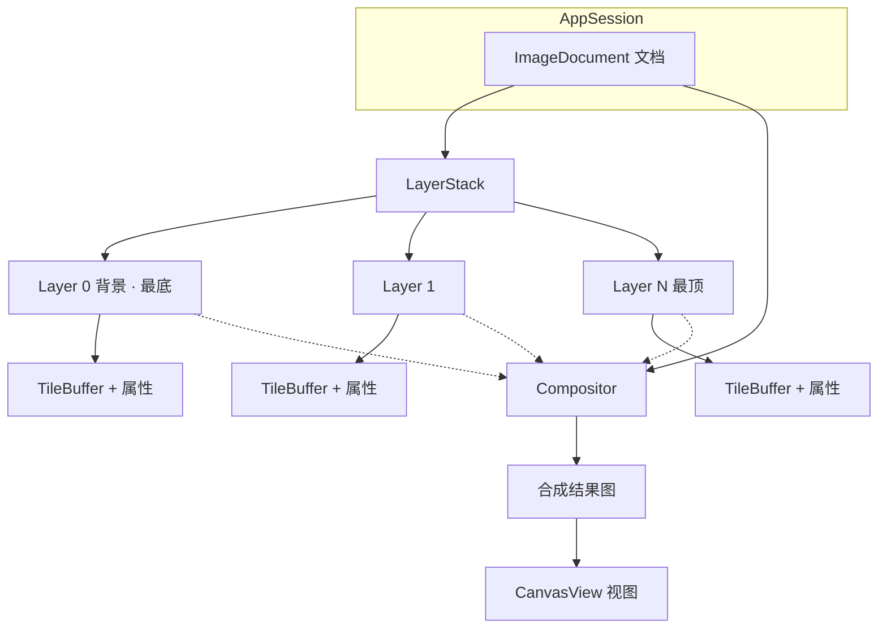

# 图层结构：文档包含图层

## 1. 层级关系

```
AppSession（当前打开哪份文档）
└── ImageDocument（文档）
    ├── 宽 × 高
    ├── 活动层下标
    └── LayerStack（图层栈，下标 0 = 最底）
        ├── Layer「背景」
        │     └── TileBuffer（可能已 fill）+ 名称 / 可见 / 不透明度 / 混合
        ├── Layer …
        │     └── TileBuffer（透明新层可为 0 块）+ 属性
        └── Layer（最顶，后合成的盖在上面）
```



要点：

- **文档包含图层**；每层逻辑上覆盖文档宽高，像素在 `TileBuffer` 里按需分配。
- **合成结果 / 视图不拥有图层**，只是读文档算出来给你看。

## 2. 新建图层 = 同一套逻辑

对照 GIMP：`gimp_layer_new` → `fill(类型)` → `add_layer`。

本 Demo：

```text
Layer(名, w, h)     // 预定瓦片格数，尚不占像素块
  → 可选 fill(...)  // 透明：不调或 clear；实色：ensure 全格
  → addLayer(...)   // 入栈
```

- 图层面板「新建」→ `addTransparentLayer`（不 fill）→ **0 块瓦片**
- 新建文档背景 → `createBlank` 里 `Layer` + `fill(白)` → 白底占满覆盖块
- 层互相独立；看见的画面是合成结果

详见 [tiles-and-memory.md](tiles-and-memory.md)。

## 3. 完整 PS 里图层还可有几何

选区「拷贝为层」等场景下，层常带：**像素块、宽高、相对文档的偏移（左上角）**。  
移动/缩放层 = 改该层几何或变换，一般不改其它层像素，再触发合成刷新。

本 Demo：层可有文档偏移（移动工具）；自由变换**确认时**可扩层 extent（拖中用 `compositePreview`，见 [../pending-dev.md](../pending-dev.md)）。
新建透明层默认仍与文档同大。

## 4. 与代码对应

| 概念 | 路径 |
|------|------|
| 文档 | `psDemo/domain/imagedocument.h/.cpp`（`createBlank` / `addTransparentLayer`） |
| 图层 / 瓦片 | `psDemo/domain/layer.*`、`tilebuffer.*` |
| 图层栈 | `psDemo/domain/layerstack.h/.cpp` |
| 换文档广播 | `psDemo/app/appsession.cpp` |
| 图层面板 | `psDemo/ui/layertreepanel.*` |
