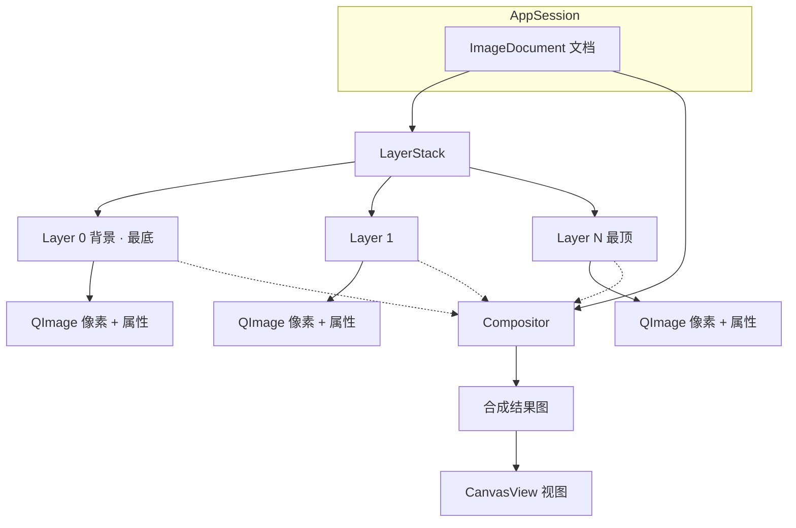

# 图层结构：文档包含图层

## 1. 层级关系

```
AppSession（当前打开哪份文档）
└── ImageDocument（文档）
    ├── 宽 × 高
    ├── 活动层下标
    └── LayerStack（图层栈，下标 0 = 最底）
        ├── Layer「背景」
        │     └── 像素 QImage + 名称 / 可见 / 不透明度 / 混合模式
        ├── Layer …
        │     └── 另一块像素 + 属性
        └── Layer（最顶，后合成的盖在上面）
```



要点：

- **文档包含图层**；每个图层是一块（通常与文档同大的）二维像素 + 元数据。
- **合成结果 / 视图不拥有图层**，只是读文档算出来给你看。

## 2. 心智模型：二维数组

- 新建文档 ≈ 开文档容器 + **第一块**二维缓冲（背景层）。
- 再新建图层 ≈ **再开一块**缓冲（本 Demo 新建层多为透明，不是再铺一层白）。
- 层互相独立；看见的画面是合成结果，不是「只有一张总图」。

内存大致随「宽 × 高 × 每像素字节 × 层数」增长（另有缩略图、撤销等）。

> **瓦片**：本 Demo 已用 `TileBuffer`（64×64）懒分配——透明新建不占整层像素；白底 `fill` 与画笔写入才 `ensureTile`。详见 [tiles-and-memory.md](tiles-and-memory.md)。

## 3. 完整 PS 里图层还可有几何

选区「拷贝为层」等场景下，层常带：**像素块、宽高、相对文档的偏移（左上角）**。  
移动/缩放层 = 改该层几何或变换，一般不改其它层像素，再触发合成刷新。

本 Demo v1：层与文档同大、对齐，尚无层偏移/自由变换。

## 4. 与代码对应

| 概念 | 路径 |
|------|------|
| 文档 | `psDemo/domain/imagedocument.h/.cpp`（`createBlank`） |
| 图层 | `psDemo/domain/layer.h/.cpp` |
| 图层栈 | `psDemo/domain/layerstack.h/.cpp` |
| 换文档广播 | `psDemo/app/appsession.cpp` |
| 图层面板 | `psDemo/ui/layertreepanel.*` |
